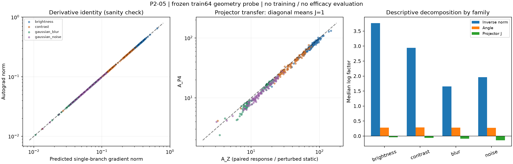

# P2-05 结果｜小响应 cosine 几何贡献得到局部支持

截至 2026-09-08：**H1 Support；0 次训练；不选择 alpha；P2-04 仍停止。**

这不是检测效果的 Go。本次只说明：在三个冻结 EMA、同一 train64 和八个扰动条件下，response 相对 perturbed-static 的特征梯度放大，主要与小有限差分向量的 cosine 几何一致。它不证明这种梯度应该被学生学习，也不证明它导致了之前的检测负结果。

## 【1. 当前阶段】

独立 P2 机制诊断已完成。P2-04 的终点保持 `769d1b66c96d5ff444fa4f9e4d4ec9961dd989b5`：Calibration Failed、selected_alpha=null、formal_training_authorized=false。

P2-05 身份链：

- 预注册协议/config：`aebf564db30d6329484f7e8fe5d66d82d5647746`。
- 执行源码：`8a990995add82afcef6d2d8b865b997eeb1a473b`。
- 本报告、原始结果、补充证据测试在执行后单独提交，不冒充执行源码的一部分。
- 此轮仅本地归档，没有推送远程；没有启动 A24 或任何 formal arm。

避免把证据 commit 写入其自身造成循环：完成归档后，可用 `git log -1 --format=%H -- experiments/rhino_d2/DINOV3_P2_RESPONSE_GRADIENT_GEOMETRY_RESULT.md` 定位本报告所属证据提交；协议与执行身份另以上述固定 SHA 为准。

## 【2. 已知事实】

CPU invariant 在固定夹角、response norm=1/0.5/0.25/0.125 时，loss 不变，gradient norm 分别为 0.25/0.5/1/2。通过后才执行真实 probe。

真实运行完成 3 seeds × 16 batches × 8 conditions = **384 个 batch-condition observations**，覆盖 1,536 个 image-condition 记录。图像只有 64 张，不是 1,536 张独立样本。

全部理论梯度向量与 autograd 吻合，最大 relative-L2 error=`1.3920194482251586e-07`，低于冻结容差 `2e-4`。这首先是实现正确性的证据，不单独构成 H1 的经验证据。

下表均为 **384 个 batch-condition 比值的中位数**；CI 为固定 batch block bootstrap 对中位数的 95% 区间。

| 观测量 | 中位数 | IQR（Q25–Q75） | 95% CI |
| --- | ---: | ---: | ---: |
| A_Z：双支 response / 单支 perturbed-static | 23.3551 | 12.6993–60.7347 | 21.7244–24.7862 |
| A_Z / sqrt(2)：去双支后的 aligned-Z 放大 | 16.5145 | 8.9798–42.9459 | 15.3614–17.5265 |
| A_P4（协议记作 A_F）：同一分母口径的 Student feature 放大 | 21.3286 | 10.9565–57.6011 | 19.6528–22.6482 |
| G_norm：固定 response 角度的 norm 分母贡献 | 12.4393 | 6.7821–32.6618 | 11.6549–13.4968 |
| G_angle：剩余角度贡献 | 1.3230 | 1.2836–1.3538 | 1.3077–1.3405 |
| J=A_P4/A_Z：投影层相对传递比 | 0.9214 | 0.8771–0.9664 | 0.9084–0.9415 |
| D：预注册 norm 主导余量（对数尺度） | 1.8884 | 1.2871–2.8475 | 1.8201–2.0020 |

不能将表中各中位数相乘来要求等于另一个中位数；乘法恒等式是逐 observation 成立的。完整 mean、sample SD、正负比例、各 seed/family/condition 分布见 summary CSV。

其中 `D=log(G_norm)-max(log(G_angle),0)-log(sqrt(2))-max(log(J),0)`：norm 的对数贡献是否超过其他正向贡献之和。它是预先固定的操作性判据，不是通用“主导”定义。

## 【3. 当前未知问题】

本次回答了“局部梯度放大在哪里出现、由哪些代数因素贡献”。仍未回答：**降低这种幅度敏感性，能否保留有用方向并形成可解释的训练信号？**

它也没有回答 response 为什么很小：模型不变性、扰动强度、BN 行为或 BF16 数值等上游原因，未在本次被独立干预。

## 【4. 主假设】

H1：在控制角度、mean reduction 和双支计数后，小 response norm 是广泛存在的主要正向放大贡献。

令 r=Zpert-Zclean、N=B*H*W。本次 N=4*16*16=1024：

```text
dL/dr = (cos(theta)*unit(r) - unit(teacher_response)) / (N*||r||)
grad_Zclean = -dL/dr
grad_Zpert  = +dL/dr

A_P4 = sqrt(2) * G_norm * G_angle * J
```

G_norm 的构造是固定 response 角度，将 response norm 分母替换成同位置的 Zpert norm，再比较完整梯度范数。这是冻结顺序的代数分解，不是将真实模型 response 人为改变后的因果实验。

证据支持该局部 H1：G_norm 的贡献明显大于角度和双支计数；J 的 pooled 中位数及其 CI 小于 1，未表现为主要的相对放大来源。不是说每一个 observation 的 J 都小于 1。

## 【5. 竞争性解释】

| 解释 | 本次证据及边界 |
| --- | --- |
| H2：主要是 projector 放大 | 未表现为 response 相对 perturbed-static 的主要放大来源：Z 空间已经明显放大，J 中位数约 0.92。只测相对传递，不能断言 projector 的绝对梯度增益小于 1，也不测 backbone/共享参数梯度。 |
| H3：只是多了一条 branch | 被削弱：双支带来确切 sqrt(2)，去掉后中位数仍为 16.51。 |
| H4：只有 brightness 推高 pooled | brightness 的确最强，但四个 family 均通过 D 判据；去除 brightness 后 A_Z/sqrt(2) 中位数仍为 12.6624，CI=[11.6534,13.6509]。 |
| H5：mean、sign、norm 统计错误 | 逐向量预测、N 因子、双支和分解检查通过；与 P2-04 归档的输入 manifest 哈希完全一致，共享 loss/P4 梯度数值回归通过。不能据此宣布所有工程问题均被排除。 |
| 夹角贡献 | 存在，但 G_angle 中位数约 1.32，弱于 G_norm。不能把“cosine 导数公式成立”当成发现了相关性。 |

研究叙事必须收紧：P2-01 Inconclusive 不等于“已经排除梯度冲突”；P2-02 的结果只削弱那次 64→128 维度解释，不是排除所有容量瓶颈；P2-03 不证明 response mismatch 导致检测失败。

## 【6. 最小实验】

未改变 teacher、学生 checkpoint、projector、tap、扰动或损失。新增内容只有两处测量空间（aligned-Z、Student-P4）的梯度诊断及汇总。

复用 `response.py` 的 FP32 strict cosine、teacher detach、八条件生成、epoch-major-v1 和 BN rollback；复用旧 calibration 的 checkpoint/input hash、teacher cache、完整 buffer 恢复。未新增 teacher、projector、loss、optimizer 或 trainer。

**源码定位更正：**现有 `StudentFeatureTap("p4")` 取 Detect 输入的第 19 层，是 neck/FPN P4，不是第 6 层 backbone P4。Student F 的 shape=[4,128,16,16]，projector 后 Z=[4,64,16,16]。本次沿用原 tap；不为匹配叙述而换层。

`response_field_kd_loss` 目前供 smoke/calibration/probe 调用，未接入正式 Foundation trainer；不能把配置存在当成正式训练已实现。

## 【7. 最便宜的前置 Probe】

执行顺序：31 项 CPU 回归通过 → 提交执行源码 `8a99099` → 脚本启动时再次先跑 CPU 数学 invariant → train64 GPU forward/autograd → 离线证据回归。没有因看到中途数据而修改代码或判读线。

训练前相关测试 31 passed；执行后加入六项证据测试，总计 **37 passed**。测试覆盖真实 Conv+BN 投影层、状态恢复、zero-norm fail-closed、符号与平均因子、独立重算 pooled bootstrap、原始产物 hash、旧 calibration 的同输入/同信号回归。

另做仅基于协议与报告的独立读者审阅，补明 A_F/A_P4 符号对应、D 定义、相对/绝对传递边界和证据提交定位。该文档检查不替代源码、raw 和 hash 核查。

## 【8. 关键观测量】

下面展示各 family 的差异，避免 pooled 掩盖强弱；数值均为 observation-level median。

| Family | A_Z/sqrt(2) | G_norm | J | D 的 95% CI |
| --- | ---: | ---: | ---: | ---: |
| brightness | 57.1590 | 43.3711 | 0.9599 | 3.0631–3.1932 |
| contrast | 26.5063 | 18.9612 | 0.9438 | 2.2226–2.3626 |
| gaussian_blur | 7.1416 | 5.2283 | 0.9146 | 0.9854–1.2413 |
| gaussian_noise | 9.1985 | 7.1157 | 0.8711 | 1.2554–1.4588 |

三个 seed 的 D CI 分别为 [1.7468,2.0379]、[1.8402,1.9926]、[1.7514,2.0212]。四个 leave-one-family-out 的 A_Z/sqrt(2) CI 下界均大于 1。

Student static norm 的“每 observation token 中位数再取中位数”为 3.8857，response 对应值为 0.3469。它们帮助理解幅度，但不应简单相除来代替 G_norm 的 token-weighted 计算。



左图验证导数；中图比较 Z 与 P4 空间；右图显示按 family 分解的对数因子。右图未画固定的 log(sqrt(2))，不是总贡献堆叠图。

**不要混淆两个比例：**P2-04 的 r_grad=4.259234 是 alpha=0.25 下 C/B 的组合 Foundation 梯度预算比，包含 clean-static、交叉项和 lambda。这里 A_P4≈21.33 是未加权 response 第二项 / perturbed-static 第二项的中位数。定义、分母和聚合不同；没有把 4.26 “改成” 21.33，也没有重新选 alpha。

## 【9. 反证条件】

事先允许：公式不符则 technical_invalid；去双支后不放大、norm 贡献不占主导或仅单个 family 驱动，则削弱 H1。

这些主要反证条件在本次冻结数据上未触发。但 D 不是处处为正：382/384 个 observation 的 D>0，2/384 为负。结论是跨 seed/family 的汇总性支持，不是普遍定律。

## 【10. Go / No-Go / Ambiguous】

原判据逐项执行：

- pooled D CI 下界>0：PASS（1.8201）。
- 至少 2/3 seed 的 D CI 下界>0：PASS（3/3）。
- 至少 3/4 family 的 D CI 下界>0：PASS（4/4）。
- 全部 leave-one-family-out 的去双支放大 CI 下界>1：PASS（4/4）。

因此 `status=H1_support`。这是预注册“norm 广泛主导”操作性判据的标签，**不是 efficacy Go，不撤销 P2-04 Calibration Failed**。

## 【11. No-confound 审计】

Planned config：ON64 epoch49.pt EMA×3、train64 SHA=`1ad936698234fd07651993dbdefe7a98ffaf74861432a103b6e397bb45b9b676`、8条件、batch4、imgsz256、P4(19)、align64、BF16 Teacher、FP32 Student/cosine。无 alpha 轴。

Resolved runtime：

- 3 个 checkpoint 文件 hash 与 state_dict digest 前后分别完全相等；参数 `.grad` 均为 None。
- Student/projector 的 BN flag 全为 train；perturbed 后恢复到 post-clean BN 状态；每个 observation 结束再恢复全部模型 buffers。task-loss EMA 的临时写入已回滚，不宣称它从未发生。
- `optimizer_steps=0`、`model_ema_updates=0`、`formal_training_started=false`。
- 每 seed：256 次 Student batch forward、144 次 Teacher batch forward、384 次 autograd.grad 调用。没有 optimizer/scheduler 对象或 step 调用。
- 64 张训练图像及标签的 128 个文件 hash 已记录，1,536 条输入 tensor manifest 的整体哈希与旧 calibration 完全一致。
- Python 文件读取守卫无拒绝事件；只向数据加载器提供 train64 隔离副本，没有读取 validation 图片、mAP 或 response128/formal 结果作为信号。Python 审计钩子不等于 OS 级全 I/O 跟踪；原生图片读取以显式 staging 清单及 tensor hash 约束。
- 数据加载器日志中的 `val:` 是 `mode="val"` 的增广关闭前缀；实际路径是隔离目录的 `labels/train2017`，不是运行 validator。
- 启动时 D2 范围干净；全局 dirty=true 来自原有未跟踪 `experiments/study/`，本次未读取或改动它。

Experimental axis：同一个 forward 图的测量位置与 static/response 第二项；没有重新训练或改变损失权重。旧 calibration 数据仅供结束后的信号回归，不参与本次选择判据。

## 【12. 成本】

实际墙钟 **148.418 秒，约 2.47 分钟 / 0.0412 GPU 小时的占用上界**（含 CPU 统计、哈希和绘图，不是 CUDA kernel-only 时间）。0 training runs。

环境：Windows、Python 3.11.15、torch 2.11.0+cu128、CUDA 12.8、NVIDIA GeForce RTX 5070 Ti；Teacher 使用本地已锁定资产，离线模式。未接近 900 秒停止线。

## 【13. Claim Boundary】

Evidence supports：冻结条件下的 response/static 梯度尺度脱钩，与小 response norm 的 cosine 分母几何广泛主导一致；projector 并非主要的相对放大来源；仅多一条 branch 和仅 brightness 两种解释不足。

Evidence does NOT support：Response-Field 提高 mAP、alpha<0.25 可行、normalization 能改善检测、P1 No-Go 由该几何导致、BF16/BN 完全无影响、所有冲突/容量问题被排除、backbone 参数更新存在同样比值。

统计限制：16 个 batch block，bootstrap 保留各 block 的全部 seed/condition，10000 次。CI 条件于已使用过的 train64、固定 batch 组成和三个 checkpoint，不是未见数据泛化 CI，也不是训练 seed 总体 CI。norm/angle 分解顺序和 D 判据是本研究操作性定义，不是通用标准。

## 【14. 证据文件与接手入口】

- [预注册协议（15项）](DINOV3_P2_RESPONSE_GRADIENT_GEOMETRY_PROTOCOL.md)：假设、反证和冻结判据。
- [固定配置](configs/d2_v3_p2_response_gradient_geometry.yaml)：资产、继承配置和容差/统计预算。
- [探针代码](scripts/probe_response_gradient_geometry.py)：`measure_geometry` 取两处梯度；`summarize` 计算 block CI；`decide` 判读；`run` 保证状态回滚。
- [raw](results/p2_response_gradient_geometry/response_gradient_geometry_raw.csv)、[summary](results/p2_response_gradient_geometry/response_gradient_geometry_summary.csv)、[result](results/p2_response_gradient_geometry/response_gradient_geometry_result.json)。
- [manifest](results/p2_response_gradient_geometry/response_gradient_geometry_manifest.json)：执行 commit、全部 hash、状态前后 digest、resolved config/environment 和访问审计边界。
- [probe.log](results/p2_response_gradient_geometry/probe.log)：从开始、每 batch、seed 到结束的结构化运行日志；不是第三方库全部 stdout 的逐字转录。
- [CPU invariant](results/p2_response_gradient_geometry/synthetic_invariants.json)、[37项回归 XML](results/p2_response_gradient_geometry/pytest-geometry.xml)。后者是运行后生成，由证据提交绑定，不在执行时 manifest 的原始产物列表中。

CPU/离线回归可在当前 checkout 运行：

```powershell
conda activate yolo-master-d2
$env:PYTHONUTF8="1"
python experiments/rhino_d2/scripts/probe_response_gradient_geometry.py --synthetic-only
python -m pytest experiments/rhino_d2/tests/test_response_gradient_geometry.py experiments/rhino_d2/tests/test_response_gradient_geometry_evidence.py experiments/rhino_d2/tests/test_response_field.py experiments/rhino_d2/tests/test_response_field_calibration.py -q
```

真实复跑需在独立、干净的执行源码 checkout（`8a99099`）恢复 manifest 指定的本地 Teacher/checkpoints/train64 资产，然后运行同一脚本、不传参数。该独立 checkout 应禁用自动换行转换（仅该 checkout 的 `core.autocrlf=false`），保留执行时 LF 源码/config 字节，否则旧资产 SHA 前置检查会正确拒绝。无需修改当前仓库或全局 Git 设置。脚本拒绝覆盖已有证据目录；不要为复跑删除此归档。临时 train64 副本留在忽略的 runtime 目录，不进入证据提交。

归档目录的局部 `.gitattributes` 禁用文本换行转换，保留 JSON、CSV、日志等产物的原始字节（含 Windows CRLF），避免跨平台 checkout 使审计 hash 失效；不改变任何历史产物。

Ruff check/format 已通过。本环境缺少 codespell，尝试执行返回 No module named codespell；未把这一项标为通过，也未为此修改环境依赖。

## 【15. 下一刀】

当前停止 GPU 工作，不启动 smaller-alpha 或正式训练。

若导师同意，下一步只讨论一个新的、独立预注册问题：**signal normalization 能否减弱本次已定位的幅度敏感性，同时不破坏 response 方向信号？** 仍应先是 train-only probe，需另定机制、反证和授权。P2-05 不替该新实验作效果保证，也没有实施它。
