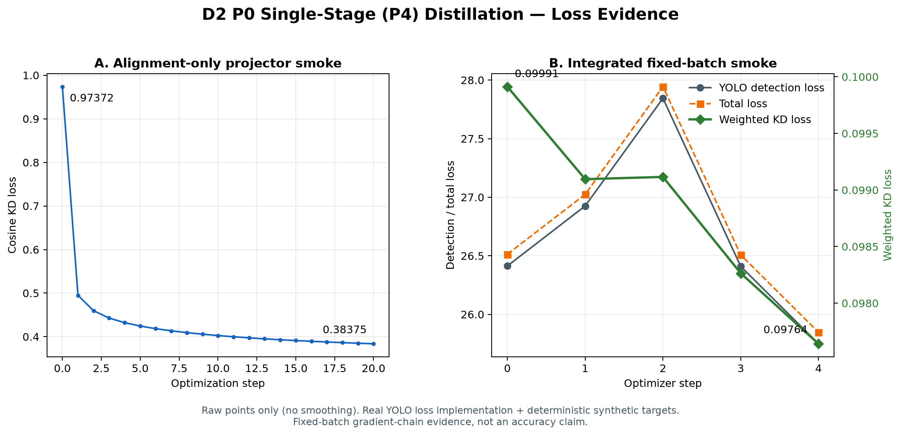

# D2 P0 验收证据：单 stage 原型、loss 曲线与设计依据

## 验收结论

P0 已形成可运行、可解释、可复现的单 stage P4 蒸馏闭环。它证明教师特征、学生 P4、投影层、KD loss、真实 YOLO detection loss 实现和反向传播已经连通；不声称提升 mAP。

## 1. 单 stage 蒸馏原型

```text
同一图像 batch
  ├─ YOLO-Master-N → Detect head 的 P4 来源特征 [B,128,14,14]
  │                     └─ trainable 1×1 projector ─┐
  └─ frozen DINOv2-small → patch feature [B,384,16,16]
                             └─ frozen projection + resize ─┤
                                                            ↓
                                             对齐到 [B,64,14,14]
                                                            ↓
                                      weighted cosine KD loss
                                                            ↓
                total loss = YOLO detection loss + weighted KD loss
                                                            ↓
                             只更新学生与学生 projector，教师冻结
```

对应代码：

- 学生 hook：`ultralytics/nn/foundation/taps.py`
- 独立 projector：`ultralytics/nn/foundation/projectors.py`
- 独立 distill loss：`ultralytics/nn/foundation/losses.py`
- 正式训练集成：`ultralytics/nn/foundation_distill_model.py`
- 可复现 smoke：`scripts/d2_p0_train_smoke.py`

## 2. Loss 曲线



图中只绘制原始点，不做平滑：

- 独立对齐 smoke：cosine KD `0.97372 → 0.38375`，证明 projector 与蒸馏损失可优化。
- 集成 fixed-batch smoke：weighted KD `0.09991 → 0.09764`，同时保留 YOLO detection loss 与 total loss 曲线。
- 数据契约：真实 YOLO detection loss 实现；同一张 `bus.jpg` 重复两次；类别 0；确定性合成归一化框 `[0.5,0.5,0.35,0.55]`。

图的全部点见 `results/d2_p0_loss_curves.csv`；来源 JSON 与图/CSV 的 SHA-256 见 `results/d2_p0_loss_curves_manifest.json`。重新生成命令：

```powershell
python experiments/rhino_d2/scripts/plot_p0_loss_curves.py
```

## 3. 设计依据

| 决策 | P0 选择 | 依据 | 暂不扩展的原因 |
| --- | --- | --- | --- |
| 蒸馏位置 | P4 单 stage | P4 在分辨率、语义抽象和显存之间折中，且直接供 Detect head 使用 | 同时上 P3/P4/P5 会引入 stage 权重和多重 shape 问题，不利于定位失败 |
| 教师层 | DINOv2 最后一层 patch tokens | 提供空间 dense 表征，可与检测特征网格对应 | pooled token 丢失空间位置；多教师会引入许可、匹配与预算混杂 |
| 空间对齐 | 教师 `16×16 → 14×14` | 保留学生 P4 网格，教师仅作为训练监督 | 改学生网格会改变检测模型结构，破坏 on/off 控制变量 |
| 通道对齐 | 共同维度 64；学生投影可训练、教师投影冻结 | 解决 `128` 与 `384` 通道不一致，同时确保梯度只流向学生侧 | 双侧都训练会让“教师目标”漂移，弱化蒸馏含义 |
| P0 loss | cosine | 对特征幅值较不敏感、实现简单、适合先验证梯度链 | Gram/关系/统计 loss 留作独立消融，不能直接缝合后宣称有效 |
| 教师状态 | eval、`requires_grad=False`、不进入 optimizer | 教师必须是稳定目标，且部署只保留学生 | 更新教师会增加预算并改变研究问题 |
| 检测监督 | 真实 loss 实现 + 合成 target | 低成本验证 task 与 KD 能共同反传 | 仅为 smoke；mAP 必须由 P1 COCO 数据 on/off 对照回答 |

## 4. P0 判定边界

当前证据满足：shape 对齐、loss 有限且非零、KD 进入 total、学生与 projector 梯度非零、教师冻结且不在 optimizer、固定 batch KD 最终低于初始、total 至少出现下降。

因此结论是“P0 单 stage 蒸馏原型跑通”。不能把它写成“蒸馏提高检测精度”；后者必须等待 P1 同预算、多 seed、置信区间对照。
